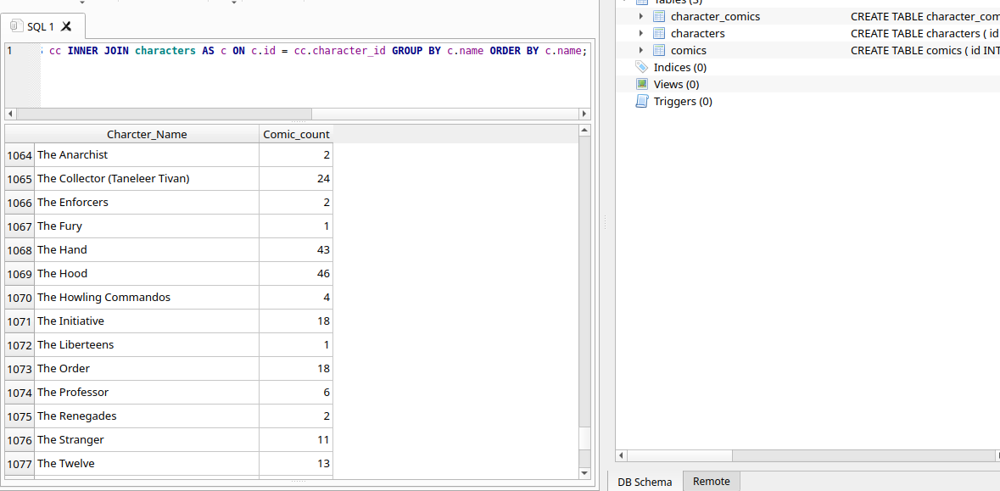
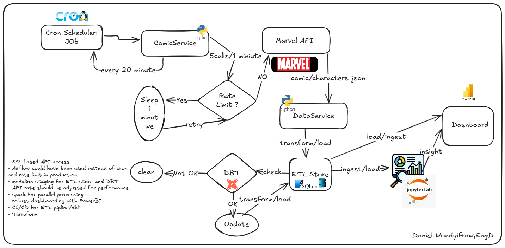
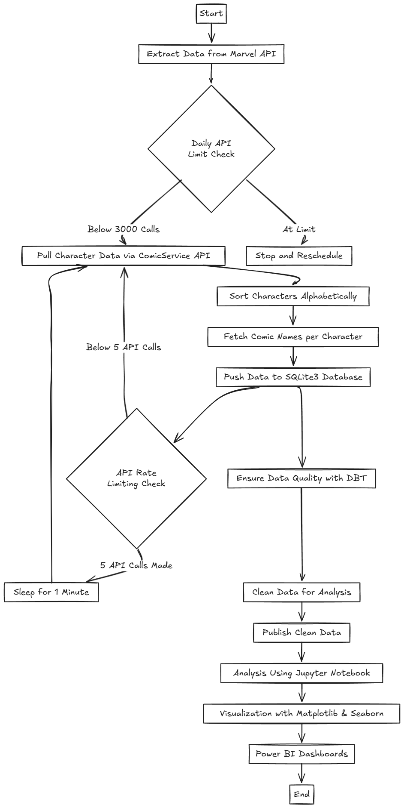

# Marvel Data Pipeline

[](architecture/count.png)

This project implements a data pipeline for Marvel comic book data. It includes data extraction, transformation, loading (ETL), and analysis using Python and SQLite3.

## Project Structure

* **`Comic_Character_Analysis.ipynb`**: Jupyter Notebook for data analysis and visualization, including plots of character and comic data, and total character counts using Pandas, with the result shown in `count.png`.
* **`DataLayer/`**: Manages data access.
    * **`DataService.py`**: Handles SQLite database interactions using `sqlite3`.
* **`ETLApp.py`**: Executes the ETL pipeline.
* **`LICENSE`**: Project license.
* **`Models/`**: Defines data models.
    * **`Comic.py`**: Data model for comic book information.
* **`README.md`**: This file.
* **`SSLcheck.py`**: Checks SSL certificates.
* **`Services/`**: Provides business logic.
    * **`ComicService.py`**: Interacts with comic data.
* **`Utils/`**: Utility modules.
    * **`Config.py`**: Manages configuration settings.
* **`architecture/`**: Contains architectural diagrams:
    * **`count.png`**: Character count result from Jupyter notebook.
    * **`drawing.png`**: Data Flow Diagram
    * **`eclidrawpipeline0.png`**: Project Data Pipeline Diagram
* **`character_comic.sql.sqbpro`**: SQLiteStudio project file.
* **`data_service.log`**: Log file for data service operations.
* **`logs/`**: Log directory.
    * **`dbt.log`**: dbt log file.
* **`marvel_dbt/`**: dbt project for data transformations.
    * **`README.md`**: dbt project README.
    * **`dbt_project.yml`**: dbt project configuration.
    * **`models/`**: dbt models.
        * **`example/`**: Example dbt models (Incomplete, see below).
    * Other dbt directories.
* **`my_marvel.db`**: SQLite database file.
* **`my_marvel.db-journal`**: SQLite journal file.
* **`raw/`**: Directory for raw data.
* **`sql/`**: SQL scripts.
    * **`backup_001.db`**: Database backup.
    * **`sql.sql`**: General SQL scripts.
* **`sqls/`**: Additional SQL scripts.

## Key Components

* **ETL Pipeline (`ETLApp.py`)**: Extracts, transforms, and loads data into `my_marvel.db` using `sqlite3`.
* **Data Modeling (`Models/Comic.py`)**: Defines the structure of comic data.
* **Data Access (`DataLayer/DataService.py`)**: Provides database interaction using `sqlite3`.
* **Data Transformation (`marvel_dbt/`)**: Uses dbt for data transformations.
* **Data Analysis (`Comic_Character_Analysis.ipynb`)**: Analyzes and visualizes data, including character and comic plots and character counts using Pandas, with the result shown in `count.png`.
* **Configuration (`Utils/Config.py`)**: Manages settings.
* **Services (`Services/ComicService.py`)**: Handles comic data interactions.
* **Database (`my_marvel.db`)**: Stores comic data.
* **Logging**: Logs data service and dbt operations.

## DBT Notes (Incomplete)

The dbt code in the `marvel_dbt/models/` directory is currently incomplete but aims to:

* **Check for null values:** Identify and handle null values in the data.
* **Check for empty records:** Identify and handle empty records in the data.
* **Create a materialized view:** Build a materialized view for joining character and comic data.

Please note that the dbt models are under development and require further refinement.

## Setup and Installation

1.  **Clone the Repository:**
    ```bash
    git clone [https://github.com/dadenewyyt/MarvelDataPipeline.git](https://github.com/dadenewyyt/MarvelDataPipeline.git)
    cd MarvelDataPipeline
    ```
2.  **Create a Virtual Environment (Recommended):**
    ```bash
    python3 -m venv venv
    source venv/bin/activate  # macOS/Linux
    venv\Scripts\activate  # Windows
    ```
3.  **Install Dependencies:**
    ```bash
    pip install -r requirements.txt  # If available
    pip install pandas requests dbt-core dbt-sqlite  # Example dependencies
    ```
4.  **Database Setup:**
    * Ensure SQLite is installed.
    * Run `ETLApp.py` to create/update `my_marvel.db`.
5.  **dbt Setup:**
    * Navigate to `marvel_dbt/`.
    * Run `dbt deps`.
    * Configure `profiles.yml` for SQLite.
    * Run `dbt run`.

## Usage

1.  **Run ETL:**
    ```bash
    python ETLApp.py
    ```
2.  **Run dbt:**
    ```bash
    cd marvel_dbt
    dbt run
    ```
3.  **Analyze Data:**
    * Open `Comic_Character_Analysis.ipynb`.
    * Run notebook cells.
4.  **Use Services:**
    * Use `ComicService.py` for data interactions.

## Key Notes

* Uses `sqlite3` directly for database operations.
* dbt for data transformations (incomplete).
* Jupyter Notebook for analysis, including character and comic plots and Pandas character counts, shown in `count.png`.
* Logging for service and dbt operations.

[](architecture/eclidrawpipeline0.png)
[](architecture/drawing.png)

This document provides an overview of the project. For detailed information, refer to the code and individual files.
**Developed by: [Daniel Wondyifraw]
